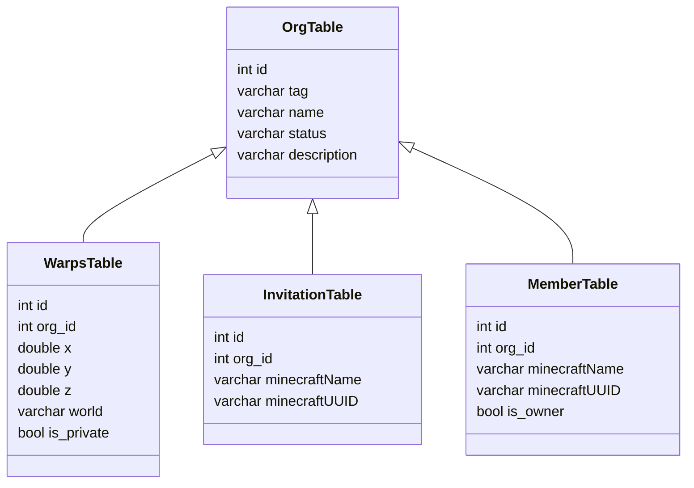

## Database diagram for KapitalystiK

```mermaid
classDiagram
OrgTable <|-- WarpsTable
OrgTable <|-- InvitationTable 
OrgTable <|-- MemberTable 
class OrgTable {
    int id
    varchar tag
    varchar name    
    varchar status
    varchar description
}

class WarpsTable {
    int id
    int org_id
    double x
    double y
    double z 
    varchar world
    bool is_private
}

class InvitationTable {
    int id
    int org_id 
    varchar minecraftName
    varchar minecraftUUID
}

class MemberTable {
    int id
    int org_id
    varchar minecraftName
    varchar minecraftUUID
    bool is_owner
}
```